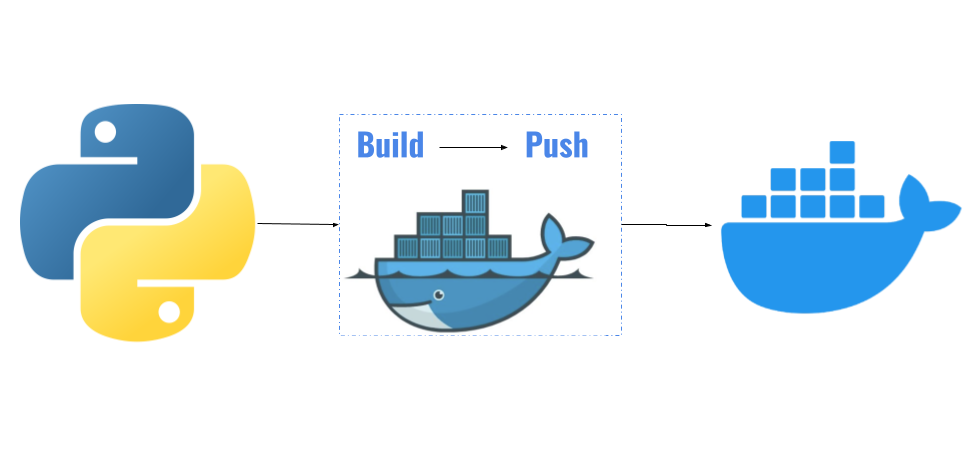
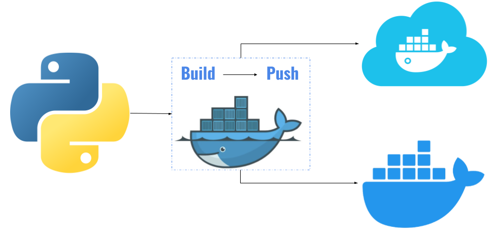
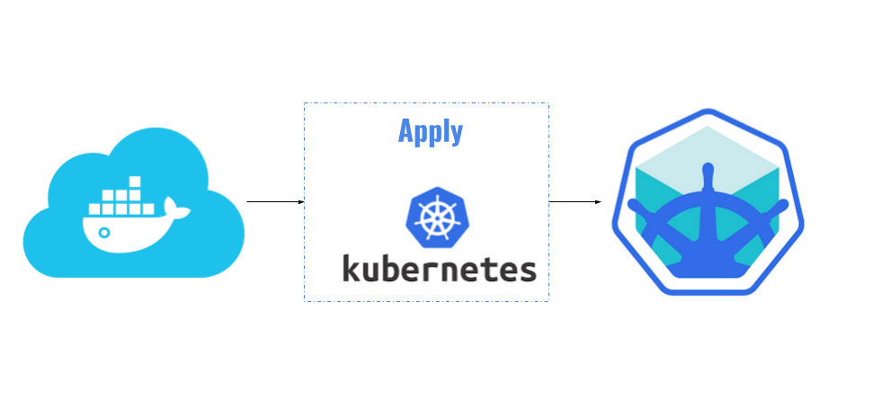
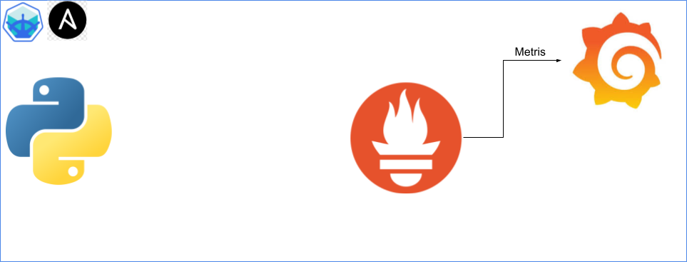
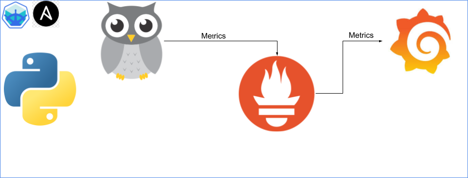
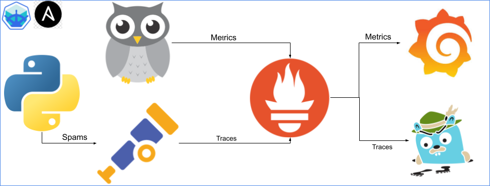

## Class 1 - Essentials
Run python application 

### Infrastructure Perspective
Apply these changes [1. Practice](./exercises/exercise1/) to achieve an infrastructure like this one:

## Class 2 - Essentials
Run python application with docker container in the local registry

### Infrastructure Perspective
Apply these changes [2. Practice](./exercises/exercise2/) to achieve an infrastructure like this one:

## Class 3 - Essentials
Run python application with docker container from the remote registry(Dockerhub)

### Infrastructure Perspective
Apply these changes [3. Practice](./exercises/exercise3/) to achieve an infrastructure like this one:

## Class 4 - Essentials
Run python application using a remote registry image with Kubernetes cluster.

### Infrastructure Perspective
Apply these changes [4. Practice](./exercises/exercise4/) to achieve an infrastructure like this one:

## Class 5 - Devops
Make the cluster bigger. Adding Prometheous

### Infrastructure Perspective
Apply these changes [5. Practice](./exercises/exercise5/) to achieve an infrastructure like this one:

## Class 6 - Devops
Make the cluster bigger. Adding Grafana and adding a dashboard

### Infrastructure Perspective
Apply these changes [6. Practice](./exercises/exercise6/) to achieve an infrastructure like this one:

## Class 7 - SRE Observability Pillars: Metrics, Traces, and Logs

### 1. Metrics
- **Metrics** are numerical values collected over time that measure the performance and health of a system.
- They are essential for identifying trends and detecting problems in the system's behavior before they escalate into incidents.
- Examples of metrics include CPU usage, latency, error rates, and network traffic.
- Metrics are used in conjunction with *Service Level Indicators (SLIs)* and *Service Level Objectives (SLOs)* to monitor and ensure system reliability.

### Infrastructure Perspective
Apply these changes [7. Practice](./exercises/exercise7/) to achieve an infrastructure like this one:

### 2. Traces
- **Traces** allow tracking the journey of a request through the different services and components of a distributed system.
- Traces are essential for diagnosing issues in microservices architectures where a single request may interact with multiple services.
- They provide visibility into how a transaction flows through the system, helping to identify bottlenecks or inefficiencies.

### Infrastructure Perspective
Apply these changes [8. Practice](./exercises/exercise8/) to achieve an infrastructure like this one:

Now let's create a metrics based on traces

### Infrastructure Perspective
Apply these changes [9. Practice](./exercises/exercise9/) to achieve an infrastructure like this one:

### 3. Logs
- **Logs** record detailed events that occur within the system, providing real-time information about its internal state.
- Logs are useful for diagnosing problems at specific moments, containing granular details about errors or particular system states.
- They are often analyzed with tools to detect patterns or anomalies.

Together, these three components (Metrics, Traces, and Logs) form the foundation of **observability**, which is crucial for Site Reliability Engineers (SREs) to maintain system reliability, detect issues, and continuously improve the systems they manage.

### Infrastructure Perspective
Apply these changes [10. Practice](./exercises/exercise10/) to achieve an infrastructure like this one:

------------------------------------------------------------------------------------------------------------------------------------------------------------------------

## Class # - SRE Alerts

## Class # - Terraform
Terraform

## Class # - Devops
Github Actions CI pipeline

## Class # - SRE
Ansible runbook

## Class # - Devops
Helm charts

## Class # - Devops
ArgoCd

