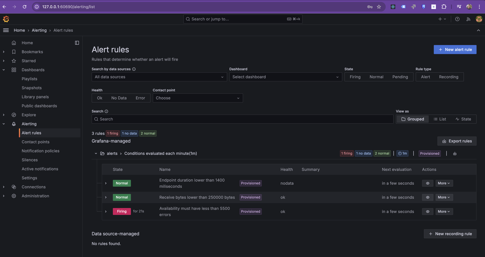

# Setting Up Alerts in Grafana for Latency and Errors Panels

Grafana alerts can notify you when a certain metric exceeds a defined threshold. Here’s how to create alerts for **Latency** and **Errors** in your Grafana dashboard.

---

### 1. Alert for Latency Panel

To create an alert for the **Latency** panel, follow these steps:

1. **Open the Latency Panel**: In your Grafana dashboard, go to the **Latency** panel.
2. **Edit the Panel**: Click on the panel title, select **Edit**.
3. **Go to the Alerts Tab**: Switch to the **Alerts** tab within the panel editor.
4. **Create a New Alert**:
   - **Click** on **Create Alert**.
   - **Condition**: Set a condition that checks the latency over a certain threshold. For example:
     ```plaintext
     WHEN sum(rate(otel_collector_span_metrics_duration_milliseconds_bucket[5m])) by (span_name) IS ABOVE 1.5 ms
     ```
   - **Time Range**: Set the evaluation period to check latency, such as over the **last 5 minutes**.
5. **Define Alert Rules**:
   - **Condition**: Set `WHEN` clause to trigger if the latency exceeds 500 ms.
   - **For**: Define a time duration to evaluate the condition, e.g., `5 minutes`.
6. **Add Notification Channel**:
   - In the **Notifications** section, choose the notification channel to receive alerts, like **Slack**, **Email**, or **PagerDuty**.
7. **Save Alert**: Save your changes to enable the alert.

This will send a notification when latency exceeds the defined threshold that represented with the red line in the image below


---

### 2. Alert for Errors Panel

To create an alert for the **Errors** panel, follow these steps:

1. **Open the Errors Panel**: In your dashboard, navigate to the **Errors** panel.
2. **Edit the Panel**: Click on the panel title and select **Edit**.
3. **Go to the Alerts Tab**: Switch to the **Alerts** tab within the editor.
4. **Set Up Alert Conditions**:
   - **Click** on **Create Alert**.
   - **Condition**: Define a condition to monitor error rate spikes. For example:
     ```plaintext
     WHEN sum(rate(container_scrape_error[5m])) by (job) IS ABOVE 1
     ```
   - **Time Range**: Use the **last 5 minutes** for the evaluation period.
5. **Configure Alert Rules**:
   - Set `WHEN` clause to trigger if the error rate exceeds a certain threshold, e.g., `1` error in the past 5 minutes.
   - Define **For** duration, such as `5 minutes`, to confirm persistent errors.
6. **Add Notification Channel**:
   - Select your preferred notification channel under **Notifications**.
7. **Save Alert**: Click **Save** to activate the alert.

---

### Example JSON for Alerts (Advanced Users)

For advanced users or those automating setup, here’s a JSON snippet you could modify and add to your dashboard configuration:

```json
{
  "alert": {
    "name": "High Latency Alert",
    "conditions": [
      {
        "evaluator": { "type": "gt", "params": [500] },
        "query": {
          "params": ["A", "5m", "now"]
        },
        "operator": { "type": "and" },
        "reducer": { "type": "avg" },
        "type": "query"
      }
    ],
    "executionErrorState": "alerting",
    "frequency": "1m",
    "handler": 1,
    "noDataState": "no_data",
    "notifications": [
      {
        "uid": "your_notification_channel_id"
      }
    ]
  }
