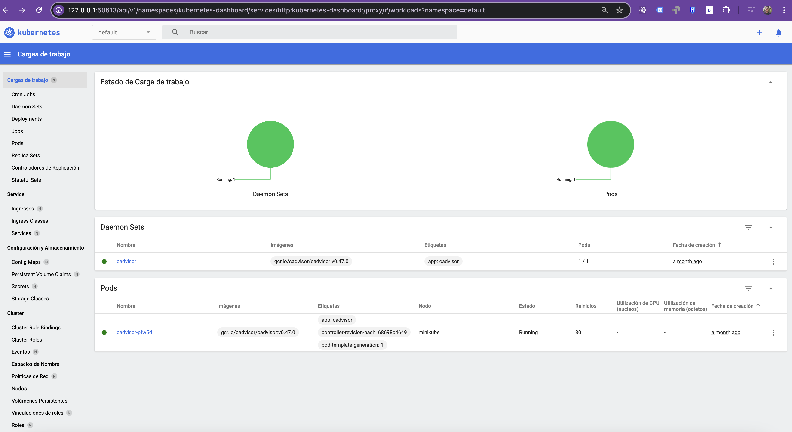

# Deploying a Python Application on Kubernetes Using Minikube

## Table of Contents
- [Introduction](#introduction)
- [Prerequisites](#prerequisites)
- [Navigate to the Application Directory](#navigate-to-the-application-directory)
- [Install Minikube on macOS](#install-minikube-on-macos)
- [Starting Minikube with Podman](#starting-minikube-with-podman)
- [Accessing the Kubernetes Dashboard](#accessing-the-kubernetes-dashboard)
- [Deploying the Application](#deploying-the-application)
  - [Deployment YAML](#deployment-yaml)
  - [Service YAML](#service-yaml)
  - [Steps to Deploy](#steps-to-deploy)
- [Exploring the Application in the Dashboard](#exploring-the-application-in-the-dashboard)
- [Final Objective](#final-objective)

---

## Introduction

This exercise will guide you through deploying a Python application to Kubernetes using Minikube with Podman as the container runtime. You will configure the deployment, expose the service, and explore the Kubernetes dashboard to observe the running application.

---

## Prerequisites

Before starting, ensure you have completed Exercises 1–3. Additionally, the following tools must be installed on your system:
- **Podman**: A daemonless container engine.
- **Minikube**: A tool to set up a local Kubernetes cluster.
- **kubectl**: The command-line tool for Kubernetes.

---

## Navigate to the Application Directory

To begin, navigate to the directory for Exercise 4:

```bash
cd sre-abc-training/exercises/exercise4
```

This directory contains the necessary YAML files for the deployment and service configuration.

---

## Install Minikube on macOS

Install Minikube using Homebrew:

```bash
brew install minikube
```

Verify the installation:

```bash
minikube version
```

---

## Starting Minikube with Podman

Minikube can run with different drivers. In this exercise, we will use Podman as the container runtime. Start Minikube with the following command:

```bash
minikube start --driver=podman --container-runtime=containerd
```

Verify the Minikube setup:

```bash
minikube status
```

---

## Accessing the Kubernetes Dashboard

Minikube includes a built-in dashboard for managing Kubernetes resources visually. Launch the dashboard using:

```bash
minikube dashboard
```

> **Note:** This command locks the terminal. Open a new terminal to continue working while the dashboard is open.

---

## Deploying the Application

In this exercise, the deployment and service YAML files are already created in the `exercise4` directory. 

### Deployment YAML

The `deployment.yaml` defines the application's deployment, including the number of replicas and the container image used. It is configured to deploy the `cguillenmendez/sre-abc-training-python-app` image.

### Service YAML

The `service.yaml` configures the Kubernetes Service to expose the application using a NodePort.

### Steps to Deploy

1. Apply the Deployment:
   ```bash
   kubectl apply -f deployment.yaml
   ```

2. Apply the Service:
   ```bash
   kubectl apply -f service.yaml
   ```

3. Verify the Pods:
   ```bash
   kubectl get pods
   ```
   Wait until all pods are in the `Running` state.

4. Verify the Service:
   ```bash
   kubectl get service sre-abc-training-service
   ```

---

## Exploring the Application in the Dashboard

1. Open the Minikube dashboard:
   ```bash
   minikube dashboard
   ```

2. In the dashboard, explore:
   - **Workloads > Deployments**: Verify the `sre-abc-training-app` deployment, its replicas, and status.
   - **Network > Services**: Check the `sre-abc-training-service`, including its NodePort and associated pods.

> **Note:** Observe how the dashboard reflects the state of the cluster before and after the deployment.

---

## Final Objective

At the end of this exercise, you should accomplish the following:

> **[!IMPORTANT]**  
> Use the Minikube dashboard to visually inspect the deployment and service. Ensure all pods are running, and the application is accessible.  
> 

---