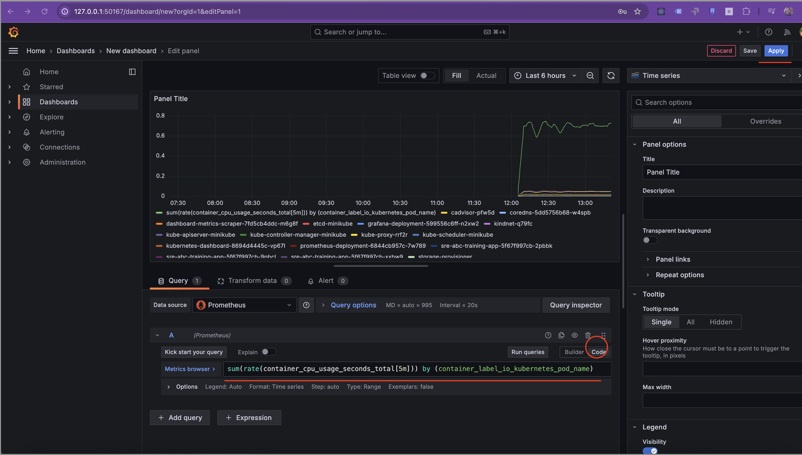

# Deploying cAdvisor and Grafana in Minikube

## Table of Contents
- [Navigate to the Application Directory](#navigate-to-the-application-directory)
- [Overview](#overview)
- [Install cAdvisor](#install-cadvisor)
  - [Key Features](#key-features)
  - [Integration with Prometheus](#integration-with-prometheus)
  - [How It Works](#how-it-works)
- [How to Use cAdvisor with Prometheus](#how-to-use-cadvisor-with-prometheus)
  - [Step 1: Running cAdvisor](#step-1-running-cadvisor)
  - [Step 2: Adding Configuration to Prometheus](#step-2-adding-configuration-to-prometheus)
- [Apply Changes to Prometheus](#apply-changes-to-prometheus)
- [Use the Metric to Build a Graph](#use-the-metric-to-build-a-graph)
- [Using the Same Query in Grafana](#using-the-same-query-in-grafana)
- [Use the YAML File to Create the New Panel](#use-the-yaml-file-to-create-the-new-panel)
- [Tip for Infrastructure as Code (IaC) with Ansible](#tip-for-infrastructure-as-code-iac-with-ansible)
- [Final Objective](#final-objective)
- [Cleanup](#cleanup)

---

## Navigate to the Application Directory

To begin, navigate to the directory for Exercise 7:

```bash
cd sre-abc-training/exercises/exercise7
```

> **Note**: This directory contains the necessary files for the exercise.  
> **Important**: Before proceeding, ensure that both Minikube and Podman are running.

---

## Overview

In this exercise, we will add a new data source for Prometheus: **cAdvisor**. This integration will allow us to observe how the number of available metrics increases in Prometheus and visualize them in Grafana.


Open Prometheus with the following command:
```bash
minikube service start prometheus-service -n monitoring
```

Use this query to validate the number of metrics available:
```promql
count({__name__=~".+"})
```


---

## Install cAdvisor

### Key Features

- **Real-time monitoring**: Collects real-time performance metrics from individual containers.
- **Resource usage statistics**: Tracks CPU, memory, filesystem, and network usage.
- **Per-container statistics**: Supports container-level granularity.
- **Built-in support for Docker**: Seamlessly integrates with Docker to monitor container stats.

### Integration with Prometheus

**cAdvisor** integrates well with **Prometheus** to provide detailed container metrics. Prometheus scrapes metrics exposed by cAdvisor and stores them as time series data for analysis and alerting.

### How It Works

1. **cAdvisor runs on each Kubernetes node**: Collects metrics from containers.
2. **cAdvisor exposes metrics on an HTTP endpoint**: Typically at `/metrics` (port `8080`).
3. **Prometheus scrapes the cAdvisor endpoint**: Stores metrics for querying and visualization.

---

## How to Use cAdvisor with Prometheus

### Step 1: Running cAdvisor

Deploy cAdvisor using the provided YAML file:
```bash
kubectl apply -f cadvisor.yaml
```

Verify the cAdvisor pod status:
```bash
kubectl get pods -n monitoring
```

### Step 2: Adding Configuration to Prometheus

Update Prometheus to scrape cAdvisor metrics by adding this job definition in `prometheus.yaml`:
```yaml
- job_name: 'cadvisor'
  kubernetes_sd_configs:
    - role: pod
  relabel_configs:
    - source_labels: [__meta_kubernetes_pod_label_app]
      action: keep
      regex: cadvisor
  metrics_path: /metrics
  scheme: http
```

---

## Apply Changes to Prometheus

Deploy the updated Prometheus configuration:
```bash
kubectl delete -f ../exercise5/prometheus.yaml
kubectl apply -f prometheus.yaml
minikube service prometheus-service -n monitoring
```

The **Targets** option in Prometheus should look like this:


Use this query to validate the updated metrics:
```promql
count({__name__=~".+"})
```


---

## Use the Metric to Build a Graph

To analyze CPU usage, use this query in Prometheus:
```promql
rate(container_cpu_usage_seconds_total[5m])
```

Group results by pod:
```promql
sum(rate(container_cpu_usage_seconds_total[5m])) by (container_label_io_kubernetes_pod_name)
```


---

## Using the Same Query in Grafana

Deploy Grafana:
```bash
kubectl apply -f ../exercise6/grafana.yaml
minikube service grafana-service -n monitoring
```

Log in to Grafana (`admin/admin`) and create a new panel:

1. Navigate to **Dashboards** → **New Panel**.
2. Select Prometheus as the data source.
3. Enter this query in the editor:
   ```promql
   sum(rate(container_cpu_usage_seconds_total[5m])) by (container_label_io_kubernetes_pod_name)
   ```
4. Click **Apply** to view the graph.



---

## Use the YAML File to Create the New Panel

To automate panel creation, update the Grafana YAML configuration:

Add this block to the `grafana.yaml` file:
```yaml
"targets": [
  {
    "expr": "sum(rate(container_cpu_usage_seconds_total[5m])) by (container_label_io_kubernetes_pod_name)",
    "refId": "B"
  }
],
"title": "Pod CPU Usage",
```

Reapply the configuration:
```bash
kubectl delete -f ../exercise6/grafana.yaml
kubectl apply -f ./grafana.yaml
minikube service grafana-service -n monitoring
```

---

## Final Objective

At the end of this exercise, you should achieve the following:
- View an updated Grafana dashboard with container metrics.
- Verify the new panel visualizing CPU usage by pod.


---

## Cleanup

Clean up resources to prepare for subsequent exercises:

1. Delete the deployments:
   ```bash
   kubectl delete -f cadvisor.yaml
   kubectl delete -f prometheus.yaml
   kubectl delete -f ../exercise6/grafana.yaml
   ```

2. Confirm no resources remain:
   ```bash
   kubectl get pods -n monitoring
   ```
   Expected output:
   ```
   No resources found in monitoring namespace.
   ```

---