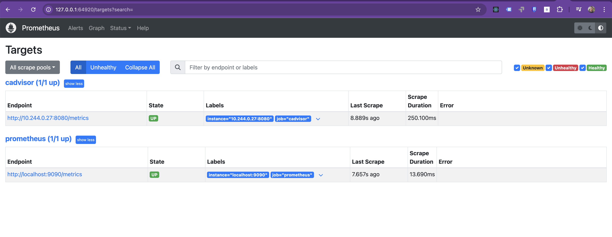
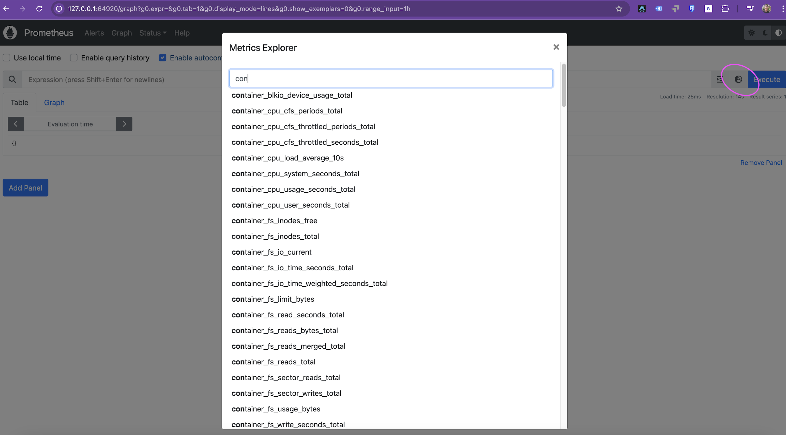
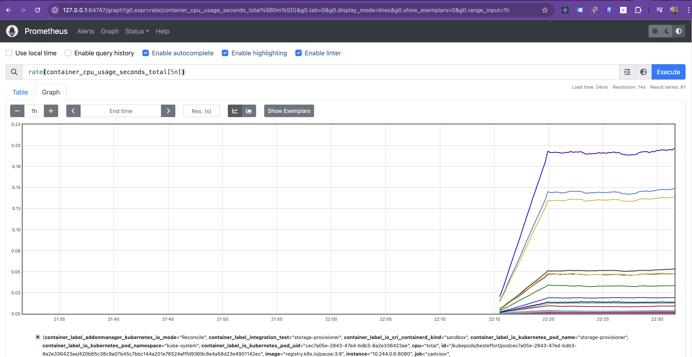

# Overview

In this exercise, we will add a new data sources for Prometheus: `cAdvisor` to observe how the number of available metrics increases in Prometheus.

Lets open the prometheus with `minikube service start prometheus-service -n monitoring` and use this query `count({__name__=~".+"})` to validate the amount of metrics available


### 2. Let´s install cAdvisor

**cAdvisor** (Container Advisor) is an open-source tool created by Google that provides resource usage and performance metrics for running containers. It collects, processes, and exports information about CPU, memory, network, and disk usage from containers, especially those managed by Docker. 

It is built directly into the Kubelet (the Kubernetes node agent) and is crucial for understanding the resource consumption of your containers, making it a key component in containerized environments.

###### Key Features

- **Real-time monitoring**: Collects real-time performance metrics from individual containers.
- **Resource usage statistics**: Tracks CPU, memory, filesystem, and network usage.
- **Per-container statistics**: Supports container-level granularity.
- **Built-in support for Docker**: Seamlessly integrates with Docker to monitor container stats.
- **Export data**:

##### Integration with Prometheus

**cAdvisor** integrates well with **Prometheus** to provide detailed container metrics. Prometheus scrapes metrics exposed by cAdvisor and stores them as time series data for analysis and alerting.

###### How It Works

1. **cAdvisor runs on each Kubernetes node**: Since cAdvisor is part of the Kubelet, it automatically collects metrics from containers on that node.
2. **cAdvisor exposes metrics on an HTTP endpoint**: It exposes metrics at `/metrics` (usually on port `8080`).
3. **Prometheus scrapes the cAdvisor endpoint**: Prometheus scrapes this endpoint to collect the metrics and store them in its time series database.
4. **Prometheus configuration**: You need to add cAdvisor as a scrape target in Prometheus to begin collecting metrics from it.

## How to Use cAdvisor with Prometheus

###### 1. Running cAdvisor

If you're running a Kubernetes cluster, cAdvisor is already built into the Kubelet, but you can also run cAdvisor as a standalone Docker container for a non-Kubernetes setup. Here's how to run cAdvisor on a Docker host:

```bash
docker run \
  --volume=/:/rootfs:ro \
  --volume=/var/run:/var/run:ro \
  --volume=/sys:/sys:ro \
  --volume=/var/lib/docker/:/var/lib/docker:ro \
  --publish=8080:8080 \
  --detach=true \
  --name=cadvisor \
  google/cadvisor:latest
```

Run this command with all the configuration

```sh
kubectl apply -f cadvisor.yaml
```

###### 2. Add extra configuratin to Prometheus
To integrate cAdvisor with Prometheus, you need to configure Prometheus to scrape cAdvisor’s metrics.

Add cAdvisor as a Prometheus scrape target:
In your prometheus.yml configuration file, add the following job definition:

```yaml
      - job_name: 'cadvisor'
        kubernetes_sd_configs:
          - role: pod
        relabel_configs:
          - source_labels: [__meta_kubernetes_pod_label_app]
            action: keep
            regex: cadvisor
        metrics_path: /metrics
        scheme: http
```

### 4. Apply changes to Prometheus 

Finally, run the yaml file with all the changes together
```sh
kubectl delete -f ../exercise5/prometheus.yaml
kubectl apply -f prometheus.yaml
minikube service prometheus-service -n monitoring
```

And the **Targets** option at http://127.0.0.1:56616/targets should look like this


use this query `count({__name__=~".+"})` to validate the amount of metrics available


### 4. Use the Metric to Build a Graph

At this point, all of these metrics should be available for use.

For more details about the container metrics exposed by cAdvisor, you can refer to their documentation here: [cAdvisor Metrics Documentation](https://github.com/google/cadvisor/blob/master/docs/storage/prometheus.md#prometheus-container-metrics).

To view the metrics in Prometheus, you can explore them by clicking this button:  


By selecting the **table view**, you will be able to see all the information that cAdvisor has sent to Prometheus. The key attributes of each message are displayed, such as `container_label_io_kubernetes_container_name`, which appears in bold in the interface. These attributes can eventually be used in Prometheus queries to group results.  


For example, you can start by using the following query to see the rate of CPU usage per container over the past 5 minutes:

```promql
rate(container_cpu_usage_seconds_total[5m])
```
This query will return the per-second rate of CPU usage for each container, allowing you to track how much CPU time each container is consuming.



Next, to group the results by pod, you can modify the query like this:
```promql
sum(rate(container_cpu_usage_seconds_total[5m])) by (container_label_io_kubernetes_pod_name)
```
This query will aggregate the CPU usage rate for each pod, providing an overview of CPU consumption grouped by Kubernetes pod.


### 4. Using the Same Query in Grafana
First, apply the Grafana configuration and expose the service using the following commands:

```sh
kubectl apply -f ../exercise6/grafana.yaml
minikube service grafana-service -n monitoring
```

Once Grafana is up and running, navigate to the dashboard:

1. Click Dashboard.
2. Select New.
3. Choose Add Visualization.
4. In the visualization panel, click on Prometheus as the data source.
5. Switch the view to the Code tab.
6. Append the following PromQL query into the editor:

```promql
sum(rate(container_cpu_usage_seconds_total[5m])) by (container_label_io_kubernetes_pod_name)
```
7. Click Apply to visualize the data.


### 5. Use the yaml file to create the new panel

To automate the panel creation with the same query, you can modify the Grafana YAML configuration.

Add the following block of code to the targets section within the Grafana dashboard configuration file (grafana.yaml):
```yaml
          "targets": [
            {
              "expr": "sum(rate(container_cpu_usage_seconds_total[5m])) by (container_label_io_kubernetes_pod_name)",
              "refId": "B"
            }
          ],
          "title": "Pod CPU Usage",
```
This will create a panel that visualizes the CPU usage of each pod.

After modifying the YAML file, re-apply the updated configuration to deploy the new panel:
```sh
kubectl delete -f ../exercise6/grafana.yaml
kubectl apply -f ./grafana.yaml
minikube service grafana-service -n monitoring
```

Once the service is running, you can view the updated dashboard and see the new panel created from the YAML file:
