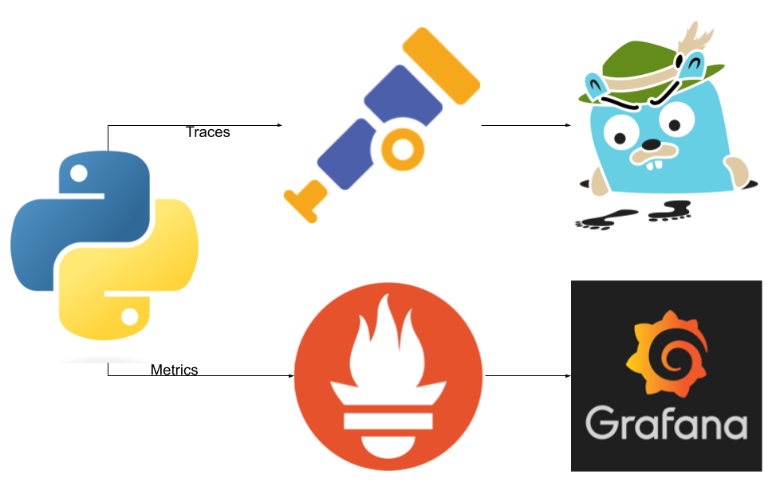
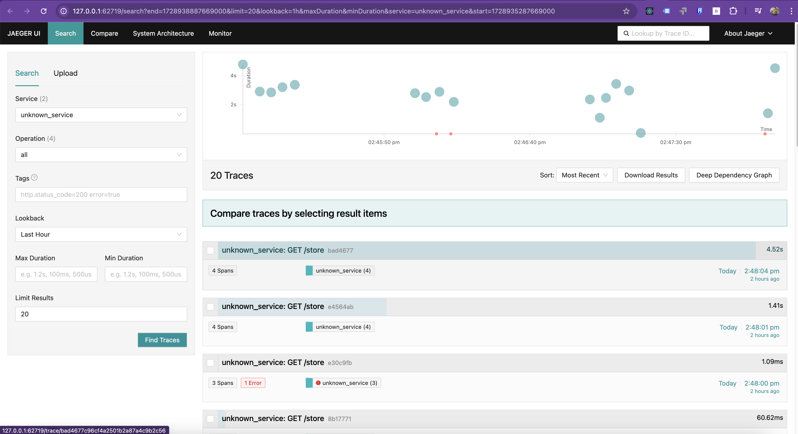

# Overview

In this exercise, we will modify a Python application to generate traces by adding some configuration to the OpenTelemetry Collector (OtelCollector). This will instrument the code to produce traces once the application is running. These traces will then be sent to the OtelCollector, and subsequently, they will be displayed in Jaeger.

## What is the OpenTelemetry Collector?

The OpenTelemetry Collector is a highly configurable component that receives, processes, and exports telemetry data (metrics, traces, and logs) from multiple sources. It acts as a bridge between instrumented applications and observability backends, like Jaeger or Prometheus.

### How does the OpenTelemetry Collector work?

The OtelCollector can be deployed as an agent or a gateway. It receives telemetry data from applications that use OpenTelemetry instrumentation. The data is processed through pipelines, which can include processors, and then exported to a designated backend for visualization or analysis. 

For example, an application can generate trace data, which the collector processes and sends to Jaeger, where the traces can be viewed and analyzed.

## What is Jaeger?

Jaeger is a distributed tracing platform designed for monitoring and troubleshooting microservices-based architectures. It allows users to trace requests as they propagate through various services, providing insights into performance bottlenecks, latency, and errors.

### How does Jaeger work?

Jaeger collects and stores trace data from applications, which is later visualized through its UI. This trace data helps developers understand how requests flow through services, identify slow services, and diagnose distributed system issues. Jaeger works by collecting span data, where each span represents a unit of work in a trace. Spans are linked together to form a complete trace of a request.

## Steps to Set Up

1. **Configure OpenTelemetry in the Python application**:
   - Install the necessary OpenTelemetry packages for Python.
   - Configure the application to generate traces.
   
2. **Set up the OpenTelemetry Collector**:
   - Configure the OtelCollector to receive traces from the application.
   - Define an export pipeline to send traces to Jaeger.
   
3. **[Deploy Jaeger](#3-deploy-jaeger-and-visialize-the-traces)**:
   - Ensure Jaeger is running and configured to receive traces from the OtelCollector.
   - Use Jaeger's UI to visualize traces.

By following these steps, you will have a Python application instrumented with OpenTelemetry, sending traces to Jaeger for monitoring and troubleshooting.




## 1. Let´s add the configuration code in to the python application

### Python Application Instrumentation with OpenTelemetry

In this example, we will extend a Python application by adding OpenTelemetry tracing configuration to instrument the code and generate traces. These traces will be sent to the OpenTelemetry Collector and then visualized in Jaeger. Additionally, we will implement a function that simulates request processing with occasional delays and exceptions.

#### Adding OpenTelemetry Tracing to the Python Application

To instrument your Python application with OpenTelemetry, you will add the following code block to set up tracing:

```python
# Set up OpenTelemetry tracing with service name
resource = Resource.create({"service.name": "sre-abc-training-app"})  # Replace with your service name

span_exporter = OTLPSpanExporter(
    endpoint="otel-collector.opentelemetry.svc.cluster.local:4317",  # Update with your OTEL Collector endpoint
    insecure=True  # Set to True if using an unencrypted connection
)

tracer_provider = TracerProvider(resource=resource)
span_processor = BatchSpanProcessor(span_exporter)
tracer_provider.add_span_processor(span_processor)
trace.set_tracer_provider(tracer_provider)

# Get tracer
tracer = trace.get_tracer(__name__)
```

##### Explanation of the Code

- **Resource**: Defines the service that will generate the telemetry data. Here, `"service.name": "sre-abc-training-app"` sets the service name. This name will appear in your trace data and helps identify which service or component the traces belong to.

- **OTLPSpanExporter**: This exporter sends spans (trace data) to the OpenTelemetry Collector. The `endpoint` points to the collector's address, and `insecure=True` specifies that an unencrypted connection will be used.

- **TracerProvider**: This is the central component that manages tracers. By setting a resource and adding a span processor, we enable the application to generate and export trace data.

- **BatchSpanProcessor**: Collects spans in batches before sending them to the collector. This improves performance compared to sending spans individually.

- **Tracer**: Represents the instrumentation part of the code. The `tracer` object is used to create spans for each unit of work that you want to trace within your application.


#### Simulating a Workload with Tracing
We will also add a function foo, which calls another function goo that will generate an exception every 5 requests. Additionally, foo will call a function zoo that introduces random processing delays between 0 and 5 seconds.
```python
import random
import time

def zoo():
    # Simulate random processing time between 0 and 5 seconds
    delay = random.uniform(0, 5)
    time.sleep(delay)
    return "Zoo function completed."

def goo():
    # Raise an exception every 5 requests
    if random.randint(1, 5) == 5:
        raise Exception("Error in goo: Simulated exception.")
    return "Goo function completed."

def foo():
    try:
        result_goo = goo()
        print(result_goo)
    except Exception as e:
        print(f"Exception in goo: {e}")
    
    result_zoo = zoo()
    print(result_zoo)
```
##### Explanation of the Functions:
- **foo**: Calls the goo and zoo functions and handles any exceptions raised by goo. This function simulates a workload that generates traceable events, such as successful function calls, delays, and errors.

- **goo**: Raises an exception once every 5 requests. This helps simulate error handling within the application, which can be visualized in the traces to monitor failure points.

- **zoo**: Introduces a random delay between 0 and 5 seconds to simulate variable processing times. This can help visualize latency in the application's execution when viewed in Jaeger.

#### Push Images

   - You can now push images to this repository using Podman commands from your terminal. For example:

 
   ```bash
   podman login docker.io
   podman tag local-image-name username/repository-name:tag
   podman push username/repository-name:tag
   ```
   At least for demostration purposes this is my personal registry with this image
 
   ```bash
   podman login docker.io
   podman build -t cguillenmendez/sre-abc-training-python-app:latest .
   podman build -t cguillenmendez/sre-abc-training-python-app:0.0.1 .
   podman push cguillenmendez/sre-abc-training-python-app:latest
   podman push cguillenmendez/sre-abc-training-python-app:0.0.1
   ```

Checkout there is a new version of the code `cguillenmendez/sre-abc-training-python-app:0.0.1`


## 2. Installing the OpenTelemetry Collector for Sending Traces to Jaeger

In this section, we will install the OpenTelemetry Collector (OtelCollector) to send traces to Jaeger. The OtelCollector acts as a middleware between your instrumented application and Jaeger, facilitating the collection and export of telemetry data. We will configure the OtelCollector with a specific exporter and service setup.

### Steps to Install the OpenTelemetry Collector
We need to define how the OtelCollector will operate by creating a configuration file. This file will specify the exporters and services that the collector will use.

Here’s an example:
```yaml
receivers:
   otlp:
      protocols:
      grpc:
         endpoint: "0.0.0.0:4317"

exporters:
   jaeger:
      endpoint: "jaeger:4317"  # Update to use the correct Jaeger endpoint
      tls:
      insecure: true  # Set to true if you are using an unencrypted connection

service:
   pipelines:
      traces:
      receivers: [otlp]
      exporters: [jaeger]
```
For more details check [Otel Collector](./otel-collector.yaml).

#### Understanding Exporters, Processors, and Services in OpenTelemetry Collector

The OpenTelemetry Collector is a crucial component for collecting, processing, and exporting telemetry data from applications. Below, we explain the key components: **exporters**, **processors**, and **services**.

##### Exporters

**Exporters** are responsible for sending the processed telemetry data (such as traces and metrics) to various backends. They act as the final destination for telemetry data collected by the OpenTelemetry Collector. 

###### Key Points:
- **Function**: Exporters transmit data to monitoring and observability tools, such as Jaeger, Prometheus, or any other compatible backend.
- **Types**: There are different types of exporters based on the destination. Common exporters include:
  - **OTLP Exporter**: Sends data to backends that support the OpenTelemetry Protocol (OTLP).
  - **Jaeger Exporter**: Specifically designed to send trace data to Jaeger.
  - **Prometheus Exporter**: Exposes metrics to Prometheus for scraping.
- **Configuration**: Exporters can be configured to include endpoints, authentication methods, and other settings relevant to the destination.

##### Processors

**Processors** are components that transform, filter, or enrich telemetry data before it is sent to exporters. They provide a way to manipulate data to meet the needs of the specific observability goals.

###### Key Points:
- **Function**: Processors can batch, sample, or modify telemetry data to reduce noise and improve performance.
- **Types**: Common processors include:
  - **Batch Processor**: Groups spans or metrics before sending them to exporters, which can improve performance by reducing the number of requests.
  - **Attribute Processor**: Adds or modifies attributes of the telemetry data based on specified rules.
  - **Filtering Processor**: Allows filtering of telemetry data to include or exclude certain data points based on defined criteria.
- **Configuration**: Processors are defined in the configuration file, specifying the order of processing and which data to apply them to.

##### Services

The **service** section in the OpenTelemetry Collector configuration defines how data flows through the system, including the pipelines for processing and exporting telemetry data.

###### Key Points:
- **Function**: The service section specifies which receivers, processors, and exporters are used to handle different types of telemetry data (such as logs, traces, and metrics).
- **Pipelines**: Pipelines are defined within the service section to connect receivers, processors, and exporters. Each pipeline can be configured separately based on the type of telemetry data being handled.
  - **Receivers**: The entry point for telemetry data.
  - **Processors**: The transformation and processing logic for the data.
  - **Exporters**: The destinations to which the data is sent.
- **Configuration**: The service section is structured to define multiple pipelines, allowing for flexible data management depending on the requirements of the observability stack.

## 3. Deploy Jaeger and visialize the traces:

### Jaeger: Distributed Tracing System

Jaeger is an open-source, end-to-end distributed tracing system developed by Uber Technologies. It helps developers monitor and troubleshoot complex, microservices-based architectures by providing insights into the performance and behavior of applications. Jaeger allows you to trace requests across multiple services, visualize latency, and identify bottlenecks in your applications.

#### Features of Jaeger

- **Distributed Context Propagation**: Allows tracking of requests as they flow through various services.
- **Performance Optimization**: Helps identify slow operations and optimize application performance.
- **Root Cause Analysis**: Aids in pinpointing the root causes of issues in distributed systems.
- **Adaptive Sampling**: Dynamically adjusts sampling rates to manage the amount of trace data collected.

#### Installing Jaeger in Kubernetes

To deploy Jaeger in a Kubernetes cluster, you can use a YAML configuration file. Below is an example of a basic deployment configuration for Jaeger.

##### Jaeger YAML Configuration

Create a file named [Otel Collector](./jaeger.yaml) with the following content:

```yaml
apiVersion: v1
kind: Service
metadata:
  name: jaeger
  namespace: observability
spec:
  ports:
    - port: 5775
      name: compact
    - port: 6831
      name: thrift-udp
    - port: 6832
      name: thrift-http
    - port: 5778
      name: config
    - port: 14250
      name: grpc
    - port: 16686
      name: ui
    - port: 14268
      name: collector
    - port: 14267
      name: agent
  selector:
    app: jaeger
---
apiVersion: apps/v1
kind: Deployment
metadata:
  name: jaeger
  namespace: observability
spec:
  replicas: 1
  selector:
    matchLabels:
      app: jaeger
  template:
    metadata:
      labels:
        app: jaeger
    spec:
      containers:
        - name: jaeger
          image: jaegertracing/all-in-one:1.41
          ports:
            - containerPort: 5775
            - containerPort: 6831
            - containerPort: 6832
            - containerPort: 5778
            - containerPort: 14250
            - containerPort: 16686
            - containerPort: 14268
            - containerPort: 14267
          env:
            - name: COLLECTOR_ZIPKIN_HTTP_PORT
              value: "9411"
          args:
            - "--log-level=debug"
```




