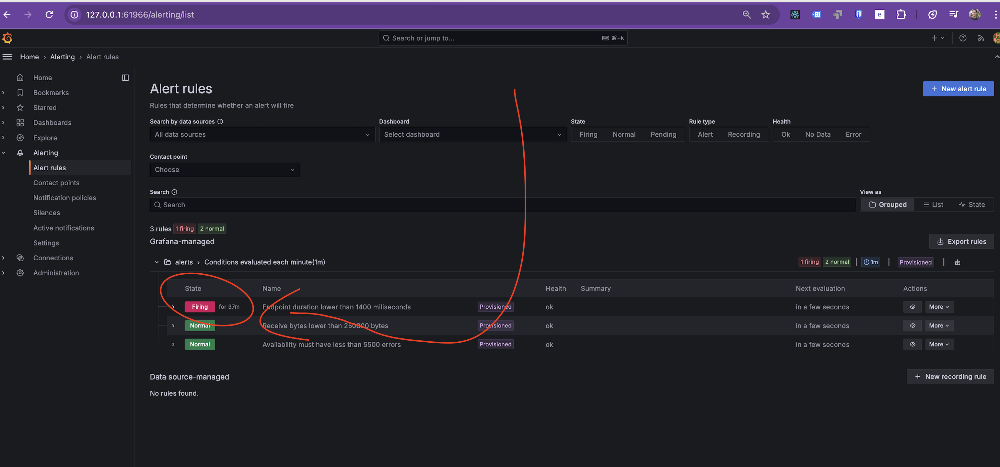

# Understanding Time to Detect, Time to Acknowledge, and Time to Resolve in SRE

> **Important Note:**  
> The following metrics—**Time to Detect (TTD)**, **Time to Acknowledge (TTA)**, and **Time to Resolve (TTR)**—are **team metrics**. They are designed to evaluate the effectiveness and responsiveness of the team in managing incidents, rather than being tied directly to product performance. This distinction is crucial because it emphasizes that the focus is on how well the team collaborates and responds to incidents, rather than on the product's inherent capabilities.

In the Site Reliability Engineering (SRE) process, three critical metrics help organizations measure and improve their incident management capabilities: **Time to Detect (TTD)**, **Time to Acknowledge (TTA)**, and **Time to Resolve (TTR)**. Understanding these metrics allows teams to enhance their response strategies and improve overall system reliability.

## 1. Time to Detect (TTD)

**Definition**: Time to Detect is the duration it takes for the monitoring systems to identify an incident or issue within the service. 

**When It Happens**: TTD begins when a failure occurs and ends when the monitoring system detects the failure.

**Importance**: A shorter TTD allows teams to respond to incidents more quickly, minimizing the impact on users. Effective monitoring and alerting systems are crucial for reducing TTD.

**Performance Metrics**:
- **Monitoring Coverage**: Ensure that all critical services and components are monitored.
- **Alerting Latency**: Measure how quickly alerts are generated after an incident occurs.

Suppose that upon receiving an alert, you begin to review the application logs and notice several errors. 



## 2. Time to Acknowledge (TTA)

**Definition**: Time to Acknowledge is the time taken by the on-call engineer or the response team to acknowledge that an incident has been detected and that they are taking action.

**When It Happens**: TTA starts when an alert is triggered and ends when the incident is acknowledged by a responsible individual or team.

**Importance**: A prompt acknowledgment indicates that the team is aware of the issue and is beginning to assess its impact. This can help in managing user expectations and coordination among team members.

**Performance Metrics**:
- **Response Time**: The average time taken for the team to acknowledge alerts.
- **Team Availability**: Assess if the on-call schedule effectively ensures that team members are available to respond promptly.

## 3. Time to Resolve (TTR)

**Definition**: Time to Resolve is the total time taken to fix the issue from the moment it was detected until it is fully resolved and the system is restored to normal operation.

**When It Happens**: TTR starts when the incident is acknowledged and ends when the service is restored to its normal operational state.

**Importance**: TTR is a critical measure of the effectiveness of the incident response process. Lowering TTR not only improves system reliability but also enhances user satisfaction.

**Performance Metrics**:
- **Mean Time to Resolve (MTTR)**: The average time taken to resolve incidents over a defined period.
- **Postmortem Analysis**: Conduct reviews after incidents to identify root causes and areas for improvement in the resolution process.


Suppose that upon receiving an alert, you begin to review the application logs and notice several errors. 


You decide to consult with the development team, who indicates that restarting the service will resolve the issue. Therefore, you execute the following commands to restart the service:

```bash
# Example commands to restart the service
kubectl get deployments -A
kubectl rollout restart deployment sre-abc-training-app -n application
```


## Decision-Making Based on Performance Metrics

To effectively manage and improve these metrics, teams should consider the following strategies:

- **Regular Monitoring**: Implement comprehensive monitoring solutions that provide real-time visibility into system performance and health.
- **Alert Configuration**: Fine-tune alert thresholds and settings to minimize noise and ensure that alerts are actionable.
- **Incident Review Process**: Conduct post-incident reviews to identify trends in TTD, TTA, and TTR, and develop action plans for improvement.
- **Automation**: Leverage automation tools to reduce manual intervention in the response process, thereby improving TTA and TTR.

By focusing on reducing TTD, TTA, and TTR, SRE teams can enhance their incident response capabilities, ultimately leading to more reliable services and improved user experiences.
